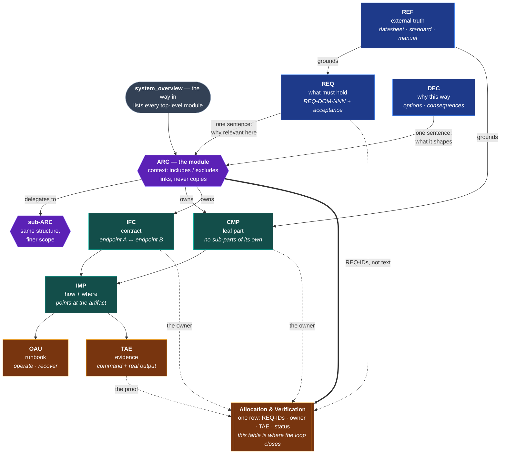

# The method, argued

The entry is [README.md](README.md): what this is, the proof, how to start,
and who it is for. This file is the argument behind it, for the reader who got
that far and wants to know why any of it is shaped this way — the failure it is
built against, how the domains connect, what the agent layer buys, and what it
takes to hand the result to somebody who was never taught the method.

The method has nine domains. A project derived with `--minimal` starts with
three of them — `REQ`, `ARC` and `TAE`, the three the tools close a loop over —
and the other six wait in `00_documentation/03_vault_domains_not_in_use/` until
it grows into them. What follows describes the whole of it.

---

## The problem this solves

Engineering documentation fails in a specific, predictable way. The same fact
gets written down in three places, two of them go stale, and nobody can tell
which one is current. A requirement exists but nothing proves it was ever met.
Six months later the only reliable source is the person who built the thing.

Point an AI agent at that, and it does not get better — it gets faster. Agents
retrieve by exact text search. Documentation that is implicit, duplicated or
out of date does not merely fail to help them; it actively misleads them, at
scale.

This template is the opposite bet: **one question per file, one place per fact,
and a machine that checks it.**

---

## How the pieces connect

The nine domains are not a pipeline. **`ARC` is the orchestrator** — one note per
module that references every other domain and owns none of their content. Read
an ARC note and you have the whole module; read it and follow one link and you
have the detail.



Four things in that picture do the real work:

**ARC references, it never absorbs.** A requirement gets one sentence in an ARC
note saying why it matters here — never its text. A decision gets one sentence
saying what it shapes — never its justification. This is what keeps a fact in
exactly one place while still making the module readable end to end.

**ARC nests, the other domains do not.** A module that mostly contains other
modules uses the main-module template: context plus a table of sub-modules,
nothing else. A module that directly owns parts uses the full template. That
single choice is what stops the architecture layer from flattening into a list.

**The CMP/ARC line is a decision rule, not a feeling.** If a thing has
sub-parts that interact, requirements allocated to it, and internal interfaces,
it is a module and gets an ARC note. Otherwise it is a leaf and gets a CMP note.

**The allocation table is the load-bearing structure.** Each row names the
requirement IDs, the component or interface that owns them, the evidence note,
and a status. A row only reaches `Verified` when a TAE link actually exists —
`Draft → Approved → Verified`, per allocation, not per file. That is what turns
"we tested it" into "these three requirements are still unproven", and it is
the one rule a tool can check for you: the exporter reads the allocation table
and names every requirement whose allocation claims more than its evidence
carries, and the validator reads the same two relations to decide whether a
requirement is covered at all.

| Domain | Question it answers | Change rate |
| ------ | ------------------- | ----------- |
| `01_requirements_(REQ)` | What should be achieved? | Stable |
| `02_decisions_(DEC)` | Why was something chosen? | Slow |
| `03_architecture_(ARC)` | How does everything connect? | Medium |
| `04_components_(CMP)` | What do references say about a component? | Stable |
| `05_interfaces_(IFC)` | How do two modules communicate? | Slow |
| `06_implementation_(IMP)` | How is it implemented? | Fast |
| `07_testing_and_evidence_(TAE)` | Did it work? | Slow |
| `08_operation_and_usage_(OAU)` | How is it operated and maintained? | Medium |
| `09_references_(REF)` | What does the external source say? | Stable |

Two more folders catch what does not fit: `98_administration_(ADM)` for project
logistics and `99_inbox_(INB)` for unclassified raw material.

---

## The AI layer

This vault is written for two audiences at once. The conventions that make it
searchable for a human in Obsidian — exact filenames, self-contained context
sections, one question per file — are the same ones that make it retrievable
for an agent.

**With Claude Code.** In a project made from this template there is nothing to
install. The skill sits in the project's own `.claude/skills/`, Claude Code
reads it from there, and its hooks look there first.

The global entry is for the other case — using the skill in projects that do
not carry it:

```bash
ln -sfn "$PWD/.claude/skills/mechatronics-docs" ~/.claude/skills/mechatronics-docs
```

That link stores a path, not an identity. Where `~/.claude/` is shared or
replicated between machines, the same path travels to hosts on which it does
not exist, and the failure is silent: the skill keeps appearing in the listing
and only the invocation fails. Keep the entry out of the replication and
create it once per machine. With Syncthing that is one line in the `.stignore`
of whichever folder root covers it, anchored to that root — `/mechatronics-docs`
when the root is `~/.claude/skills`, `/skills/mechatronics-docs` when it is
`~/.claude`. `.stignore` is per device and is never synchronised, so the line
is written on each machine. A Claude Code update can remove a symlinked entry
as well, which is the second reason the command above is worth re-running
rather than remembering.

One command says which copy a machine actually reaches:

```bash
python3 .claude/skills/mechatronics-docs/validate_vault.py --check-install
# -> reaches this copy / dangling / reaches a different copy / no entry at all
```

Call it through the repository path, as written. On a host where the entry is
broken, the path through the entry is the one thing that cannot work.

Which of the two spellings of that path is right follows from who types it.
The skill's own text writes `${CLAUDE_SKILL_DIR}/validate_vault.py`, and
Claude Code substitutes that placeholder in the skill's Markdown before a
session reads it, so the call reaches the copy that is actually running — and
a broken entry is never that copy, which is why the check above is typed by
hand with a real path instead. Nothing outside a session expands the
placeholder. Wherever a person or a script types the command — `README.md`,
`CLAUDE.md`, the CI workflow, a project derived from this template — what
works is the path to a copy on disk: the repository path where the project
carries the skill, `~/.claude/skills/mechatronics-docs/` where it does not.

It ships with two Claude Code hooks, and a third that needs no Claude Code at
all (below). After every write into the vault, the validator checks
the file and feeds findings straight back into the session. At turn end, a stop
gate blocks completion on errors introduced during that session — ratcheted
against git `HEAD`, so pre-existing issues in legacy files never hold you
hostage.

**Without Claude Code.** The validator is a dependency-free Python script. Run
it manually or in CI:

```bash
python3 .claude/skills/mechatronics-docs/validate_vault.py path/to/01_projectvault
# -> ERRORs block, WARNs advise, warnings alone still exit 0
```

That third hook covers what the editor gates never see — an Obsidian edit, a
hand edit, a subagent write. It validates the staged files at commit time and
reports without blocking:

```bash
ln -sf ../../.claude/skills/mechatronics-docs/hooks/pre_commit_vault.sh \
       .git/hooks/pre-commit
```

Set `MECHDOCS_PRECOMMIT_BLOCK=1` to make it refuse a commit whose staged files
carry ERRORs.

Its own test suite lives next to it:

```bash
bash .claude/skills/mechatronics-docs/tests/run.sh
```

---

## Handing it to someone else

The vault is readable in Obsidian or as raw Markdown, which is no help to a
reviewer, an examiner or an auditor who has not been taught the method. One
command turns it into something that is:

```bash
python3 .claude/skills/mechatronics-docs/export_traceability.py \
        00_documentation/01_projectvault --output-dir ../traceability
```

It writes five files: a self-contained `traceability.html` report, a
requirement-centric `traceability_requirements.csv`, an edge-list
`traceability_edges.csv` that pivots into either direction, `traceability.json`
carrying the whole graph, and `traceability_index.md` — one line per object and
per requirement, written for the agent or the newcomer who wants to know what
the vault contains before opening anything. Standard library only, like the
validator.

Three things make it worth reading rather than filing.

**Both directions, and only one of them is written down.** Requirement to
evidence comes from the allocation table; evidence to requirement is computed
from the same edges in one pass. No note in the vault stores a back-link, so
nothing can drift, and the JSON marks which fields were authored and which
were derived.

**What is unproven is stated, not left as an empty cell.** A requirement that
nothing allocates, an allocation that never reached `Verified`, a status
carrying a qualifier, an evidence note that does not name the requirement it
is linked from — each is a row with a reason, in its own section at the top of
the report. ISO 26262-8 asks for the reasons of verification steps not
executed, and ECSS-E-ST-10-02C for a close-out status with its justification;
an empty cell answers neither.

**It does not quietly understand less than it claims.** A table in a section no
template declares, an identifier that exists nowhere, a domain folder the alias
map does not know: all reported. A range like `REQ-BAT-001 bis REQ-BAT-009` is
expanded only when every identifier it yields actually exists.

The export is not Markdown, so it does not belong in the vault — the exporter
refuses to write there. `00_documentation/02_documents/` is its home when you
want to keep a dated revision; anywhere outside the project works for a
throwaway one.

**Against a safety standard.**
[IEC_61508_MAPPING.md](IEC_61508_MAPPING.md) places the nine domains and the
eight typed relations against the clause structure of IEC 61508, and states
what the standard has titles for that this vault has no home for. It is a
structural correspondence and explicitly **not** a claim of conformance; the
file says that first, and says exactly how far the reading behind it went —
clause numbers and published titles, from previews, with the standard itself
paywalled.

> **A note on the CSV.** Values are written exactly as the vault spells them,
> including a cell that begins with `=`. OWASP records that the usual
> formula-injection prefixes may not survive a spreadsheet round-trip, so a
> prefix would corrupt the record without closing the hole. Open the CSV
> through your spreadsheet's text-import path rather than by double-clicking
> it.
