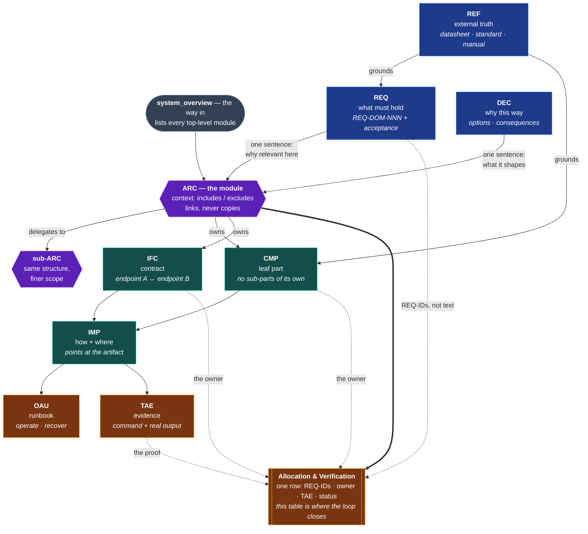

<div align="center">

# Obsidian Engineering Vault

**A documentation system for hardware, firmware and software projects —
built so that both humans and AI agents can be trusted with it.**

Every requirement traces to a proof. Every file answers exactly one question.
A validator enforces it mechanically, so the documentation cannot quietly rot.

[](LICENSE)
[](../../generate)
[](https://obsidian.md)
[](.claude/skills/mechatronics-docs)
[](.claude/skills/mechatronics-docs/tests/run.sh)

</div>

---

## The problem this solves

Engineering documentation fails in a specific, predictable way. The same fact
gets written down in three places, two of them go stale, and nobody can tell
which one is current. A requirement exists but nothing proves it was ever met.
Six months later the only reliable source is the person who built the thing.

Point an AI agent at that, and it does not get better — it gets faster. Agents
retrieve by exact text search. Documentation that is implicit, duplicated or
out of date does not merely fail to help them; it actively misleads them, at
scale.

This template is the opposite bet: **one question per file, one place per fact,
and a machine that checks it.**

---

## How the pieces connect

The nine domains are not a pipeline. **`ARC` is the orchestrator** — one note per
module that references every other domain and owns none of their content. Read
an ARC note and you have the whole module; read it and follow one link and you
have the detail.



Four things in that picture do the real work:

**ARC references, it never absorbs.** A requirement gets one sentence in an ARC
note saying why it matters here — never its text. A decision gets one sentence
saying what it shapes — never its justification. This is what keeps a fact in
exactly one place while still making the module readable end to end.

**ARC nests, the other domains do not.** A module that mostly contains other
modules uses the main-module template: context plus a table of sub-modules,
nothing else. A module that directly owns parts uses the full template. That
single choice is what stops the architecture layer from flattening into a list.

**The CMP/ARC line is a decision rule, not a feeling.** If a thing has
sub-parts that interact, requirements allocated to it, and internal interfaces,
it is a module and gets an ARC note. Otherwise it is a leaf and gets a CMP note.

**The allocation table is the load-bearing structure.** Each row names the
requirement IDs, the component or interface that owns them, the evidence note,
and a status. A row only reaches `Verified` when a TAE link actually exists —
`Draft → Approved → Verified`, per allocation, not per file. That is what turns
"we tested it" into "these three requirements are still unproven", and it is
the one rule the validator can check for you.

| Domain | Question it answers | Change rate |
| ------ | ------------------- | ----------- |
| `01_requirements_(REQ)` | What should be achieved? | Stable |
| `02_decisions_(DEC)` | Why was something chosen? | Slow |
| `03_architecture_(ARC)` | How does everything connect? | Medium |
| `04_components_(CMP)` | What do references say about a component? | Stable |
| `05_interfaces_(IFC)` | How do two modules communicate? | Slow |
| `06_implementation_(IMP)` | How is it implemented? | Fast |
| `07_testing_and_evidence_(TAE)` | Did it work? | Slow |
| `08_operation_and_usage_(OAU)` | How is it operated and maintained? | Medium |
| `09_references_(REF)` | What does the external source say? | Stable |

Two more folders catch what does not fit: `98_administration_(ADM)` for project
logistics and `99_inbox_(INB)` for unclassified raw material.

---

## What you get

- **A complete vault skeleton** — every domain with a README explaining what
  belongs there and a file template to copy.
- **A four-question gate** before any file is created: does this information
  deserve to exist, what single question does it answer, which role does it
  play, at what change rate. If a question cannot be answered cleanly, the file
  gets split instead of written.
- **Machine-readable frontmatter** on every note — `domain`, `status`,
  `created`, `last-verified` — so freshness is a queryable property, not a
  guess.
- **A validator** that checks naming, required sections, frontmatter,
  wikilink and artifact-path integrity, requirement-table format, REQ↔TAE
  coverage, and implementation details leaking into architecture files.
- **A Claude Code skill** that writes into the vault under those rules, gated
  by hooks that run the validator after every write.
- **The surrounding project structure** — hardware, software, test data,
  procurement, sources, releases — so documentation is not an island.

---

## Quick start

```bash
# 1. Create your repo from this template (or clone it)
git clone https://github.com/jrmmhm/obsidian-engineering-vault.git my-project
cd my-project

# 2. Check the vault is intact — expect 0 errors
python3 .claude/skills/mechatronics-docs/validate_vault.py \
        00_documentation/01_projectvault
```

Then open the vault:

1. Open Obsidian → **Open folder as vault**
2. Select `00_documentation`
3. Read `01_projectvault/README.md` — it lays out the reading order

Finally, make it yours: update `LICENSE`, fill in
`01_projectvault/00_project_summary.md`, and add your first module to
`01_projectvault/system_overview.md`.

> **New to the method?** Read
> `01_projectvault/00_documentation_file_creation_and_conventions.md` before
> writing anything. It is short, and it is the part that makes the rest work.

---

## The AI layer

This vault is written for two audiences at once. The conventions that make it
searchable for a human in Obsidian — exact filenames, self-contained context
sections, one question per file — are the same ones that make it retrievable
for an agent.

**With Claude Code.** Symlink the bundled skill into your skills directory and
it activates automatically in any project with this layout:

```bash
ln -s "$PWD/.claude/skills/mechatronics-docs" ~/.claude/skills/mechatronics-docs
```

It ships with two hooks. After every write into the vault, the validator checks
the file and feeds findings straight back into the session. At turn end, a stop
gate blocks completion on errors introduced during that session — ratcheted
against git `HEAD`, so pre-existing issues in legacy files never hold you
hostage.

**Without Claude Code.** The validator is a dependency-free Python script. Run
it manually, in a pre-commit hook, or in CI:

```bash
python3 .claude/skills/mechatronics-docs/validate_vault.py path/to/01_projectvault
# -> ERRORs block, WARNs advise, exit code reflects the worst finding
```

Its own test suite lives next to it:

```bash
bash .claude/skills/mechatronics-docs/tests/run.sh
```

---

## Repository layout

```
├── 00_documentation/
│   ├── 01_projectvault/    Obsidian vault — Markdown only, the SSOT
│   └── 02_documents/       internal PDFs and exports, mirrors the vault domains
├── 10_hardware/            CAD sources, exports, PCB, electronics
├── 20_software/            code, one folder per repo-worthy responsibility
├── 30_testdata/            raw and processed measurement data
├── 40_procurement/         BOM, quotes, orders, invoices, payments
├── 50_sources/             external truth — datasheets, standards, papers
├── 60_releases/            baseline snapshots
├── 90_administration/      non-engineering project material
├── 99_archive/             superseded content, kept not deleted
└── .claude/skills/mechatronics-docs/
                            the documentation skill, validator and tests
```

Full rules for what belongs where — including the two distinctions that trip
people up most — are in **[STRUCTURE.md](STRUCTURE.md)**.

---

## Who this is for

Built for mechatronics work, where a single project spans mechanics, electronics,
firmware and host software, and where the documentation has to survive a
handover. It transfers cleanly to anything with the same shape: robotics,
lab instrumentation, embedded products, homelab infrastructure, research
hardware.

If your project is pure application software, the domain model will feel heavy —
`CMP` and `IFC` earn their keep once physical parts are involved.

The vault is language-agnostic. This template ships in English; the domain
abbreviations are just folder names, and translating them is a rename away.

---

## License

MIT — see [LICENSE](LICENSE).

Keep it if you are open-sourcing your project, or replace it with your own.
Either way, update the copyright line to your name.
